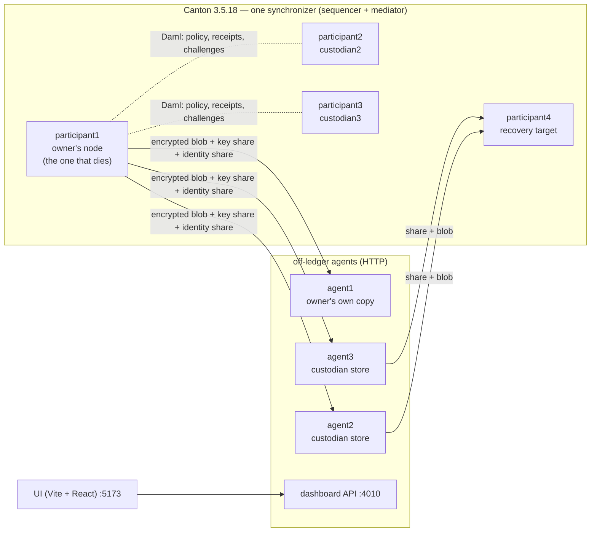

<p align="center">
  
</p>

# Tessera

**Operational continuity for Canton participants.** Survive participant loss without losing your
operational identity.

In Rome, a *tessera hospitalis* was a token broken into pieces, one for each party to an alliance.
Fitting the pieces back together proved the bond. Tessera does the same with a Canton party's
secrets: its signing key and its backup key are split among custodians, and no single piece means
anything. Only k pieces put back together prove who the owner is, and give the owner back the
ability to act. It is Shamir's secret sharing, two thousand years early.

Tessera belongs to the disaster-recovery category. What it is built for is the part that category
usually leaves out: after the participant is gone, the same party keeps operating, with the same
identity, its state and counterparties that don't have to do anything.

> The network doesn't store your data. It stores the proof that your data is recoverable — and the
> custodian network gives you back not just your data, but your party's ability to act.

Built for the Canton Network hackathon (AppsFactory). Everything described as working below runs
against the real Canton **3.5.18** open-source binary in Docker. The participant loss in the demo is
real: a participant container is killed and its disk volume deleted, not simulated.

---

## The problem

Canton is private by design: each participant keeps its contracts (its *Active Contract Set*, ACS)
on its own node, and the network never holds them in readable form. That also makes the participant
a single point of failure for everything its parties do:

- If a node's database is corrupted and its backups are lost, the state is gone. Nobody else holds
  a copy.
- Even with a backup, an operator can't tell whether it is still restorable until they need it.
- Even with the data restored, the party can't operate. If its signing key died with the node,
  nobody can act for it. What is really lost is the party's **operational identity**, not just its
  data.
- Getting a participant back by hand means Canton's repair procedures. Canton's own documentation
  calls them ["dangerous and complex"](https://github.com/digital-asset/canton/blob/main/docs-open/src/sphinx/participant/howtos/recover/repairing.rst)
  and strongly advises running them only "with the help of technical support".

## What Tessera does

1. **Backs up the ACS privately.** The owner's agent exports its party's ACS and encrypts it with
   AES-256-GCM. It replicates the ciphertext to several custodians (other participants' agents)
   and splits the encryption key k-of-n with Shamir Secret Sharing. No custodian ever sees
   plaintext, and fewer than k shares reveal nothing. (The custodian store itself has no
   authentication in this demo topology — see [the limitations](#known-limitations).)
2. **Protects the identity the same way.** The owner is a Canton *external party*, meaning its
   signing key lives outside any participant. That key is Shamir-split to the same custodians as
   independent shares.
3. **Uses Canton for coordination, not storage.** A Daml model registers:
   - the policy: custodians, k, n;
   - each custodian's on-ledger custody receipt;
   - challenges and responses;
   - recovery requests.

   Blobs travel off-ledger, over HTTP.
4. **Recovers onto a different, live participant**, in four stages shown live in the dashboard:
   1. **Identity key rebuilt.** In the demo, the participant loss deletes the owner's private key
      along with the node. `recover` rebuilds it from k custodians' identity-key shares, and checks it against
      the owner party a custodian sees on its own ledger. It never reads a key from disk, and it
      touches nothing if this stage fails.
   2. **Identity re-authorized.** The owner party is re-hosted on the new participant with a
      topology transaction signed by the rebuilt key. The dead node takes no part.
   3. **Data key reconstructed** from k custodian shares.
   4. **State imported.** The decrypted ACS goes into the new participant. That is the state as of
      the last backup, not as of the participant loss (see the limitations).
5. **Lets the counterparties verify the result.** Each custodian's participant and the recovered
   one independently hash the state they share (Canton's ACS commitments, once per reconciliation
   interval, here 1 minute), and Canton compares the two. The dashboard's "Counterparty
   verification" panel shows the result for each pair:
   - waiting for the recovered node's commitment;
   - `Match`;
   - periods in disagreement.
6. **Proves the party is operating again.** A counterparty with no special handling proposes a new
   contract. The recovered owner accepts it, signing with its own identity from the new node. The
   resulting contract's only signatory is the owner.
7. **Hands over a recoverability report.** The dashboard's "Download recoverability report" button
   generates a standalone, printable HTML page from the same live data on screen: the verdict
   (recoverable or not, against the real custodian count and k), the policy, and what the report
   does *not* cover. No new backend call — it's built from `/status` and `/positions`.

## What's real and what isn't

| Claim | Status |
|---|---|
| ACS export → encrypt → Shamir 2-of-3 → distribute → recover from 2 shares → import | **Real**, demo path |
| Custodians only ever hold ciphertext (shown live in the UI from a custodian's own volume) | **Real** |
| Owner is an external party; its key never lives inside Canton | **Real** |
| Party re-hosted on a different participant after its node's disk is deleted | **Real**, demo path |
| Recovered owner signs a new contract from the new node | **Real**, demo path |
| On-ledger policy, custody receipts, challenges, recovery requests (Daml) | **Real**. See the limitations on what the challenge proves |
| Owner's private key deleted with the participant, rebuilt from custodians' Shamir shares | **Real**, demo path. `make destroy-node` deletes `owner.der`; `recover` rebuilds it from 2 identity-key shares and writes it back only after verifying it |
| ACS commitments match between independent participants | **Real** (`check-commitment`, before the participant loss) |
| Recovered state checked against the counterparties' ACS commitments | **Real**, demo path. After recovery, the dashboard shows Canton's own comparison between each custodian's node and the recovered node. It gave `Match`, with zero disagreeing periods, in 2 of 2 measured runs, 40–75 s after recovery. It is shown on screen, not a gate: `recover` doesn't wait for it. See the limitations for what it covers |
| Degraded backups automatically detected and re-replicated | **Not implemented** |
| Scale: 1,000 extra contracts backed up, participant destroyed, party recovered, counterparty transacts | **Real**, measured 2026-10-02 with `scripts/scale-test.sh`: 1,009 active contracts for the owner before and after (counted through the Canton console on both participants), backup 12.8 s, `recover` 44.3 s, custodian store 233 KB, closing transaction 42.9 s on the recovered node. One run, one laptop |
| Running on DevNet / MainNet | **Not done.** Local Docker topology only |

## Architecture



Three pieces:

- **`daml/` — the on-ledger model.**
  - `BackupPolicy.daml`: `BackupPolicy`, `CustodianAgreement`, `Challenge`/`ChallengeResponse`,
    `RecoveryRequest`/`RecoveryResponse`.
  - `Position.daml`: the positions at stake, i.e. the state the demo loses.
  - `Record.daml`: `RecordProposal`/`Record`, used for the closing proof.
- **`agent/` — the per-node service, about 80% of the code.**
  - Handles export and import (Canton `repair` commands), encryption, Shamir, distribution and
    challenge responses.
  - Handles recovery, including external-party re-hosting via Interactive Submission and topology
    signing.
  - Runs the custodian HTTP store (`serve`) and the owner-facing dashboard API (`dashboard`).
- **Transport** — plain HTTP between agents. The sequencer never carries backup blobs. It has
  traffic fees, pruning and size limits, and Canton is the audit layer here, not storage.

Why it's built this way (Shamir on the key rather than the data, external parties, commitments,
permissions and more): **[docs/DECISIONS.md](docs/DECISIONS.md)**.

## Quick start

Prerequisites:
- **Docker Desktop with at least 10 GB of memory and 4+ CPUs allocated.** The stack runs 5 Canton
  JVMs plus 3 agents and the dashboard.
- **Node.js and pnpm** for the UI.
- **`curl`.**
- **Run it on an otherwise-quiet machine.** `participant1`'s storage (H2) uses a single-connection
  pool; under real host CPU contention (other heavy builds, a loaded browser, a video call) we've
  seen `bootstrap` hang for minutes with no log output, and once seen `participant1` crash fatally
  on a database-connection timeout. Both are host load, not a bug — see docs/README.md's
  Troubleshooting — but closing other heavy processes before `make demo-reset` (and before the live
  demo) avoids it rather than requiring a retry.

Nothing else needs installing: `make build-dar` fetches the Daml tooling (`dpm`) locally if it
isn't already on `PATH`.

```sh
make build-dar     # build the Daml model (once, or after changing daml/)
make rebuild       # build the shared agent image
make demo-reset    # fresh environment → verified pre-disaster state (a few minutes)

cd ui && pnpm install && pnpm dev    # dashboard at http://localhost:5173
```

The first run also builds the Canton image from the official 3.5.18 release tarball.

`make demo-reset` ends with `verify-demo-state`, which fails and names the exact problem unless the
environment really is pre-disaster:
- the owner is live on `participant1`;
- custody is accepted;
- the challenges are answered;
- the positions are seeded.

Every step is idempotent. If a transient Canton or Docker error appears under heavy host load,
re-run it.

The full run guide, CLI and HTTP API reference, and troubleshooting are in
**[docs/README.md](docs/README.md)**.

## The demo (about 5 minutes)

| Time | What happens | How |
|---|---|---|
| 0:00 | **Destroy the node.** Kill `participant1`, delete its disk, and delete the owner's private key file. | `make destroy-node` |
| 0:10 | The dashboard detects the death on its own. The positions that were at stake stay on screen. | Real reachability polling every 3 s |
| 0:35 | Show what a custodian actually holds: raw ciphertext. | UI footer, fetched live from `agent2`'s volume |
| 1:05 | **Recover.** The identity key is rebuilt from the 2 independent custodians, the identity is re-authorized, then the data key is reconstructed and the state imported. The owner's own copy (`agent1`) is skipped on purpose. | **Recover** button, or `docker compose run --rm agent recover ...` |
| 3:00 | **Counterparty transacts.** The recovered owner signs a new contract itself. | **Counterparty transacts with recovered owner** button |
| ~4:00 | **Counterparty verification.** Canton's own ACS-commitment comparison between each custodian's node and the recovered node: waiting, then `Match`. It is visible from the moment recovery succeeds. | Panel under the signed contract, no click |
| optional | **Recoverability report.** Downloadable at any point, not tied to a specific beat — shows the verdict and policy as of that moment. | **Download recoverability report** button |

The nodes are always killed from a terminal, never from the dashboard. The dashboard is an
unauthenticated local API and deliberately cannot kill containers.

Measured on a laptop (Apple Silicon, Docker Desktop, 8 CPUs), on a clean `make demo-reset`
environment, with the actions run back to back through the same HTTP API the buttons use:

| Step | Time |
|---|---|
| `make destroy-node` | 2.4 s |
| **Recover (RTO)**, click to result | **54.8 s** |
| &nbsp;&nbsp;↳ identity key rebuilt from 2 custodian shares | 0.8 s |
| &nbsp;&nbsp;↳ identity re-authorized on the new participant | 39.1 s |
| &nbsp;&nbsp;↳ data key reconstructed | < 0.1 s |
| &nbsp;&nbsp;↳ state imported | 15.0 s |
| Closing transaction, clicked immediately | 47.9 s |
| **Total technical time**, destroy → recovered → counterparty transacted | **≈ 1:45** |

Notes on these numbers:
- Most of the closing step's time is Canton finishing the party's onboarding on the new node.
- A second run measured 43.7 s for recovery and 54.9 s for the closing step.
- Under sustained host load, fresh recoveries have taken up to about 100 s. The dashboard shows
  the live timer.

## Known limitations

These are stated rather than hidden.

- **Below k custodians, nothing is recoverable.** With the demo's configuration (k = 2, two
  third-party custodians, and the owner's own copy skipped on purpose), there is **no tolerance for a
  custodian outage**. `recover` skips an unreachable custodian and tries the next, but there is no
  spare to try.
- **No backup, no recovery. Anything after the last backup is lost.** Backups are point-in-time
  snapshots taken by `distribute`, so the RPO is the time since the last distribution (shown as
  "Backup freshness"). There is no continuous or delta backup.
  - Contracts created after the last snapshot are not on the recovered node, and the recovery
    itself does not warn about them.
  - Canton's ACS commitments do detect the gap: the recovered participant's commitments with its
    counterparties read `Mismatch`. We saw this in a rehearsal where the snapshot predated the
    custodians' receipts.
  - To avoid that in the demo, `make demo-reset` takes a final backup after every pre-disaster
    contract exists.
- **Custody receipts point at the previous backup.** A receipt (`CustodianAgreement`) records the
  hash of the blob the custodian received, so it can never be inside that same blob. After the
  final refresh, the on-ledger receipts carry the hash of the earlier blob, not the one the
  custodians now hold. Receipts are not re-issued per backup.
- **The custodian store has no authentication.** Anyone who can reach a custodian's HTTP port can
  read its blob and shares, including identity-key shares, or overwrite them. That includes other
  custodians. In practice this voids the "no single custodian can decrypt" property against anyone
  with network access. The on-ledger `RecoveryRequest` is recorded but not enforced as a gate for
  releasing shares. The dashboard and the participants' Ledger APIs are unauthenticated too. This
  is a local demo topology, not a deployment.
- **Challenges record a proof, but nobody verifies it.** A custodian answers with
  HMAC(share, challengeId). The owner doesn't keep what it would need to check that answer, and the
  dashboard shows a custodian as healthy when *any* response exists. So today the challenge shows
  liveness and willingness, not proof of possession. Challenges also have no deadline.
- **No automatic re-replication.** A custodian that stops answering is shown, not replaced.
  `frequencyHours` in the policy isn't enforced, and `challenge-loop` exists but isn't run by
  default.
- **The commitment check comes after recovery, and it is partial.**
  - It covers only contracts the recovered owner shares with parties on the custodians'
    participants. Contracts with nobody else on those nodes aren't compared.
  - It compares periods *after* recovery, on the new participant pair. The dead node's own
    pre-disaster commitment history is gone.
  - `recover` doesn't wait for it or fail on it: the panel reports, it doesn't gate.
  - A verdict needs at least one reconciliation interval (1 minute here). We measured 40–75 s
    after recovery.
- **What's recovered is an external party**, onto a different participant. The dead participant's
  own node identity and any *local* parties it hosted aren't recovered.
- **The owner's public party id survives the participant loss** (`owner.party-id.txt`): it's public
  information that every counterparty sees on-ledger, and the dashboard reads it. The private key
  does not survive. After recovery, the rebuilt key is written back to the owner-side key store,
  so the owner can keep signing.
- **Demo simplifications:**
  - Custodian-side commands (`accept-custody`, `respond`) run from the shared `agent` CLI
    container, which mounts every custody volume read-only. They don't run on each custodian's own
    infrastructure.
  - One exports volume is mounted into all agents.
- **The agent reads a party's whole ACS in one JSON API response.** `queryActive` asks the
  Ledger JSON API for every active contract of a party and filters by template on the client. The
  JSON API caps that list (200 by default); the 1,000-contract scale test hit the cap and broke
  `recover`'s identity check and the closing transaction. The participants now raise it to 100,000
  (`http-list-max-elements-limit` in `infra/canton/participant*.conf`). The real fix, server-side
  template filters plus pagination, isn't done.
- **Local only.** The stack is tested on a single machine with Docker Desktop. It hasn't run on
  DevNet.

## Repository layout

```
daml/     Daml model + build script (make build-dar)
agent/    per-node service and CLI (TypeScript, Node)
ui/       dashboard (Vite + React + React Flow)
infra/    docker-compose topology, Canton configs, Canton image
docs/     run guide & reference (README.md), design decisions (DECISIONS.md), build checklist (ROADMAP.md)
scripts/  scale test (scale-test.sh: back up and recover N contracts, default 1,000; wipes and
          resets the environment)
spikes/   frozen proof-of-mechanism scripts for external-party recovery (historical)
```

## Checks

```sh
(cd agent && pnpm install && pnpm typecheck && pnpm test)   # test = encrypt + Shamir 2-of-3 + decrypt round trip
(cd ui && pnpm install && pnpm typecheck)
make demo-reset                                            # end-to-end environment check (ends in verify-demo-state)
```

## Credits

Built by Tomas Cormack for the Canton Network hackathon (AppsFactory).

## License

[Apache License 2.0](LICENSE).
