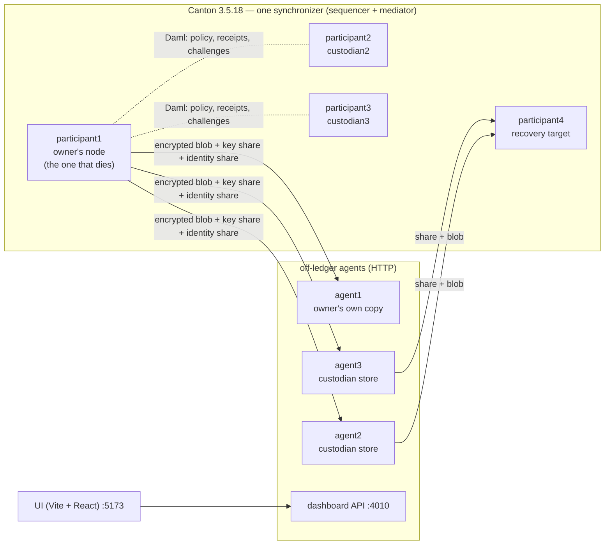

# canton-dr

**Verifiable, decentralized disaster recovery for Canton Network nodes.**

> The network doesn't store your data. It stores the proof that your data is recoverable — and the
> custodian network gives you back not just your data, but your party's ability to act.

Built for the Canton Network hackathon (AppsFactory). Everything described as working below runs
against the real Canton **3.5.18** open-source binary in Docker. The disaster in the demo is real: a
participant container is killed and its disk volume deleted, not simulated.

---

## The problem

Canton is private by design: each participant keeps its contracts (its *Active Contract Set*, ACS)
on its own node, and the network never holds them in readable form. That is also a single point of
failure:

- If a node's database is corrupted and its backups are lost, the state is gone — nobody else holds
  a copy.
- Even with a backup, an operator can't tell whether it is still restorable until they need it.
- Even with the data restored, the party still needs to sign again. If its key died with the
  node, the restored contracts are useless.

## What canton-dr does

1. **Backs up the ACS privately.** The owner's agent exports its party's ACS and encrypts it with
   AES-256-GCM. It replicates the ciphertext to several custodians (other participants' agents)
   and splits the encryption key k-of-n with Shamir Secret Sharing. No custodian ever sees
   plaintext, and fewer than k shares reveal nothing.
2. **Protects the identity the same way.** The owner is a Canton *external party*, meaning its
   signing key lives outside any participant. That key is Shamir-split to the same custodians as
   independent shares.
3. **Uses Canton for coordination, not storage.** A Daml model registers:
   - the policy: custodians, k, n;
   - each custodian's on-ledger custody receipt;
   - challenges and responses;
   - recovery requests.

   Blobs travel off-ledger, over HTTP.
4. **Recovers onto a different, live participant**, in three stages shown live in the dashboard:
   1. **Identity re-authorized.** The owner party is re-hosted on the new participant with a
      topology transaction signed by the owner's own key. The dead node takes no part.
   2. **Key reconstructed** from k custodian shares.
   3. **State imported.** The decrypted ACS goes into the new participant.
5. **Proves the party is operating again.** A counterparty with no special handling proposes a new
   contract. The recovered owner accepts it, signing with its own identity from the new node. The
   resulting contract's only signatory is the owner.

## What's real and what isn't

| Claim | Status |
|---|---|
| ACS export → encrypt → Shamir 2-of-3 → distribute → recover from 2 shares → import | **Real**, demo path |
| Custodians only ever hold ciphertext (shown live in the UI from a custodian's own volume) | **Real** |
| Owner is an external party; its key never lives inside Canton | **Real** |
| Party re-hosted on a different participant after its node's disk is deleted | **Real**, demo path |
| Recovered owner signs a new contract from the new node | **Real**, demo path |
| On-ledger policy, custody receipts, challenges, recovery requests (Daml) | **Real**. See the limitations on what the challenge proves |
| Identity key protected by Shamir (`distribute-identity` / `recover-identity`) | **Real, but not yet in the demo path.** Verified with a genuinely deleted key file. `recover` currently reads the owner key from the owner-side identity volume, which survives the demo's disaster. Wiring the Shamir reconstruction into `recover` is the next change. |
| ACS commitments match between independent participants | **Real** (`check-commitment`, before the disaster) |
| Recovered state automatically validated against ACS commitments | **Not implemented.** See the limitations |
| Degraded backups automatically detected and re-replicated | **Not implemented** |
| Running on DevNet / MainNet | **Not done.** Local Docker topology only |

## Architecture



Three pieces:

- **`daml/` — the on-ledger model.**
  - `BackupPolicy.daml`: `BackupPolicy`, `CustodianAgreement`, `Challenge`/`ChallengeResponse`,
    `RecoveryRequest`/`RecoveryResponse`.
  - `Position.daml`: the positions at stake, i.e. the state the demo loses.
  - `Record.daml`: `RecordProposal`/`Record`, used for the closing proof.
- **`agent/` — the per-node service, about 80% of the code.**
  - Handles export and import (Canton `repair` commands), encryption, Shamir, distribution and
    challenge responses.
  - Handles recovery, including external-party re-hosting via Interactive Submission and topology
    signing.
  - Runs the custodian HTTP store (`serve`) and the owner-facing dashboard API (`dashboard`).
- **Transport** — plain HTTP between agents. The sequencer never carries backup blobs. It has
  traffic fees, pruning and size limits, and Canton is the audit layer here, not storage.

Why it's built this way (Shamir on the key rather than the data, external parties, commitments,
permissions and more): **[docs/DECISIONS.md](docs/DECISIONS.md)**.

## Quick start

Prerequisites:
- **Docker Desktop with at least 10 GB of memory.** The stack runs 5 Canton JVMs plus 3 agents and
  the dashboard.
- **Node.js and pnpm** for the UI.
- **`curl`.**

Nothing else needs installing: `make build-dar` fetches the Daml tooling (`dpm`) locally if it
isn't already on `PATH`.

```sh
make build-dar     # build the Daml model (once, or after changing daml/)
make rebuild       # build the shared agent image
make demo-reset    # fresh environment → verified pre-disaster state (a few minutes)

cd ui && pnpm install && pnpm dev    # dashboard at http://localhost:5173
```

The first run also builds the Canton image from the official 3.5.18 release tarball.

`make demo-reset` ends with `verify-demo-state`, which fails and names the exact problem unless the
environment really is pre-disaster:
- the owner is live on `participant1`;
- custody is accepted;
- the challenges are answered;
- the positions are seeded.

Every step is idempotent. If a transient Canton or Docker error appears under heavy host load,
re-run it.

The full run guide, CLI and HTTP API reference, and troubleshooting are in
**[docs/README.md](docs/README.md)**.

## The demo (about 5 minutes)

| Time | What happens | How |
|---|---|---|
| 0:00 | **Destroy the node.** Kill `participant1` and delete its disk. | `docker stop -t 1 infra-participant1-1 && docker rm infra-participant1-1 && docker volume rm infra_participant1_data` (from `infra/`) |
| 0:10 | The dashboard detects the death on its own. The positions that were at stake stay on screen. | Real reachability polling every 3 s |
| 0:35 | Show what a custodian actually holds: raw ciphertext. | UI footer, fetched live from `agent2`'s volume |
| 1:05 | **Recover.** Identity re-authorized, then key reconstructed from the 2 independent custodians, then state imported. The owner's own copy (`agent1`) is skipped on purpose. | **Recover** button, or `docker compose run --rm agent recover ...` |
| 3:00 | **Counterparty transacts.** The recovered owner signs a new contract itself. | **Counterparty transacts with recovered owner** button |

The nodes are always killed from a terminal, never from the dashboard. The dashboard is an
unauthenticated local API and deliberately cannot kill containers.

Measured on a laptop (Apple Silicon, Docker Desktop):
- **Fresh recovery (RTO):** about 40–100 s, depending on host load. The dashboard shows the live
  timer.
- **Closing transaction:** about 35–55 s, mostly waiting for Canton to finish onboarding the party
  on the new node.
- **Full timed run** (destroy → recover → close, without narration): 2:58.

## Known limitations

These are stated rather than hidden.

- **Below k custodians, nothing is recoverable.** With the demo's configuration (k = 2, two
  third-party custodians, and the owner's own copy skipped on purpose), there is **no tolerance for a
  custodian outage**. `recover` skips an unreachable custodian and tries the next, but there is no
  spare to try.
- **No backup, no recovery.** Backups are point-in-time snapshots taken by `distribute`, so the RPO
  is the time since the last distribution (shown as "Backup freshness"). There is no continuous or
  delta backup.
- **The custodian store has no authentication.** Anyone who can reach a custodian's HTTP port can
  read its blob and shares, including identity-key shares, or overwrite them. That includes other
  custodians. In practice this voids the "no single custodian can decrypt" property against anyone
  with network access. The on-ledger `RecoveryRequest` is recorded but not enforced as a gate for
  releasing shares. The dashboard and the participants' Ledger APIs are unauthenticated too. This
  is a local demo topology, not a deployment.
- **Challenges record a proof, but nobody verifies it.** A custodian answers with
  HMAC(share, challengeId). The owner doesn't keep what it would need to check that answer, and the
  dashboard shows a custodian as healthy when *any* response exists. So today the challenge shows
  liveness and willingness, not proof of possession. Challenges also have no deadline.
- **No automatic re-replication.** A custodian that stops answering is shown, not replaced.
  `frequencyHours` in the policy isn't enforced, and `challenge-loop` exists but isn't run by
  default.
- **Commitments aren't part of recovery.** `check-commitment` shows real matching ACS commitments
  between live participants before a disaster. The recovered state isn't compared automatically:
  the recovery target is a different participant with no commitment history, and the command
  reports Canton's result without asserting `Match`. After a disaster the dead node's own
  commitment history is gone too, so verification means asking the counterparty; it isn't local.
- **What's recovered is an external party**, onto a different participant. The dead participant's
  own node identity and any *local* parties it hosted aren't recovered.
- **The identity key in the demo path:** see the table above. Its Shamir recovery is implemented
  and verified on its own, but isn't yet what `recover` uses.
- **Demo simplifications:**
  - Custodian-side commands (`accept-custody`, `respond`) run from the shared `agent` CLI
    container, which mounts every custody volume read-only. They don't run on each custodian's own
    infrastructure.
  - One exports volume is mounted into all agents.
- **Local only.** The stack is tested on a single machine with Docker Desktop. It hasn't run on
  DevNet.

## Repository layout

```
daml/     Daml model + build script (make build-dar)
agent/    per-node service and CLI (TypeScript, Node)
ui/       dashboard (Vite + React + React Flow)
infra/    docker-compose topology, Canton configs, Canton image
docs/     run guide & reference (README.md), design decisions (DECISIONS.md), build checklist (ROADMAP.md)
spikes/   frozen proof-of-mechanism scripts for external-party recovery (historical)
```

## Checks

```sh
(cd agent && pnpm install && pnpm typecheck && pnpm test)   # test = encrypt + Shamir 2-of-3 + decrypt round trip
(cd ui && pnpm install && pnpm typecheck)
make demo-reset                                            # end-to-end environment check (ends in verify-demo-state)
```

## Credits

Built by Tomas Cormack for the Canton Network hackathon (AppsFactory).

## License

[Apache License 2.0](LICENSE).
